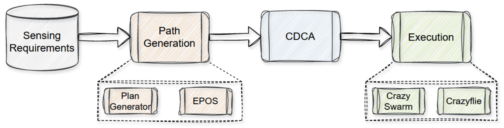

# M-SET: Multi-drone Sensing Experimentation Testbed
This project can be used to execute drone sensing missions on a testbed which aims to provide a real-world simulation of drones on an experimentation testbed. It uses the [EPOS](https://github.com/epournaras/EPOS) algorithm to generate efficient paths, and then applies collision avoidance algorithms as EPOS does not account for collisions. There is also support to execute these paths on a swarm of [Crazyflies](https://www.bitcraze.io/products/crazyflie-2-1/).


## Installation

After cloning the repository, cd to its location. To create the self-documented config file, run:

### Linux
```bash
  python -m venv M-SET
  source M-SET/bin/activate
  cd ..
  python3 setup.py
  python3 -m pip install -r requirements.txt
```
### Windows
```bash
  python -m venv M-SET
  M-SET/Scripts/activate
  cd ..
  python3 setup.py
  python3 -m pip install -r requirements.txt
```
Now the config file ```drone_sense.properties``` should appear in the root of the project.

## Demo
Take a look at the demo.py for a good example of how to use this project, as so:
```
python3 demo.py
```


## Sensing missions
A sensing mission must be defined for the path generator to optimise paths from. These files are in the format:
| type | id | x | y | z | value      |
|------|----|---|---|---|------------|
| SENSE| 0  | 1 | 1 | 1 | 36.5       |
| SENSE| 1  | 1 | 2 | 1 | 60         |
| SENSE| 2  | 1 | 3 | 1 | 36         |
| BASE | 0  | 0 | 0 | 0 | 0          |
| BASE | 1  | 4 | 0 | 0 | 0          |

Where BASE denotes base stations, where the drones will start/end their journeys, and SENSE is the locations the drones will hover at to sense.

**Please note:**

- The collision avoidance methods implemented so far only account for 2D coordinates, so please keep all z values as 1.
- Currently the path generator is deterministic, so the same input will result in the same output.
- Additionally, you should ensure there is a base station for each drone as they will start in the same place at the same time otherwise.


## Components



### Path generator

To use the path generator, set up the drones_sense.properties config file, including setting the MissionName to the name you want the results to be stored in, set MissionFile to the absolute path of the sensing mission, and set the  number of drones you want to execute the sensing. The drone parameters should be set to values for the Crazyflie drones on creation. These drones have a small battery capacity, so change these parameters for larger scale

To get the plans from the path generator, do:
```
pg = PathGenerator()
plans = pg.generate_paths()
```

### Collision Avoidance
We have implemented the strategy design pattern which allows us to seamlessly chose the desired collision avoidance method when creating the swarm_controller object, as so:

```
sc1 = Swarm_Control(parsed_plans, Potential_Fields_Collision_Avoidance())
sc2 = Swarm_Control(parsed_plans, Basic_Collision_Avoidance())
```
This method also allows for easy extension, so adding additional collision avoidance strategies is straightforward and encouraged. Implement the abstract Collision_Strategy class to do so.

We have implemented 2 methods so far, with slightly different behaviours:

#### Basic Collision Avoidance
This method solves each collision type with simple solutions. For  head-on collisions, it diverts one drone around the other, and for all other collision types, it delays movement from hover positions until doing so won't result in collision.

Since this method identifies the collision type, it is also responsible for generating collision data with:
```
collision_data = sc1.get_offline_collision_stats()
```
However, you can call this function on a swarm_controller object of any strategy.

#### Potential Fields Collision Avoidance
This method creates a Potential Fields Grid (PFG) of vectors. Each vector in the grid indicates the direction the drone should travel to reach its goal and avoid collisions from that position.
It works by creating an attractive PFG which points the drone towards its goal, and repulsive PFG's to repel the drone from other drones. The PFG's are summed (at each position) to combine to create an overall PFG for each drone at each TIME_STEP.


### Collision Avoidance Config file
The configuration file for collision avoidance can currently be found in cdca/src/Swarm_Constants.py

**Configuration Parameters**

| Parameter          | Description                                                             |
|--------------------|-------------------------------------------------------------------------|
| SPEED              | The speed at which the drone travels                                    |
| TIME_STEP          | The duration of each timestep in seconds                                |
| DISTANCE_STEP      | The distance a drone will travel in one timestep                        |
| MINIMUM_DISTANCE   | The minimum distance between drones before it is considered a collision |

Setting these values are important to scale with large sensing missions, especially with Potential Fields. The bigger the values, the less expensive it will be. An **important thing to note** is that the MINIMUM_DISTANCE should be **greater** than DISTANCE_STEP for accurate results.
